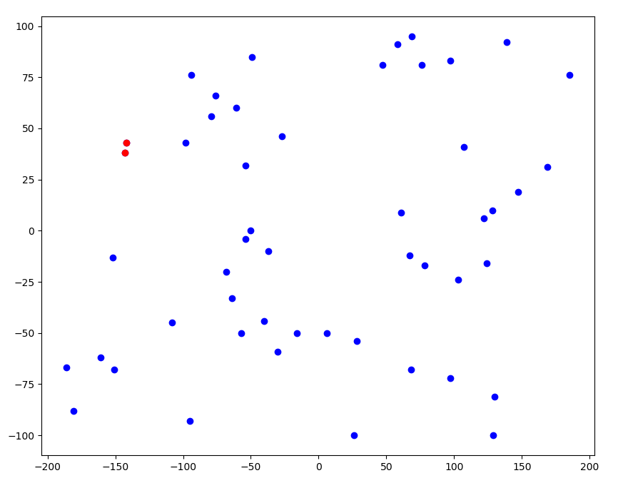

# Closest points algorithm: 

Getting the minimum distance (or the closest pair of point) between a large number of 2D points is a really expensive problem. Its brute force solution, consisting of calculating distance between points 2 by 2 and then getting the minimum, has a time complexity of the order of n squre, where n is the length of the list of pairs.

Here, i’m going to give a solution that has a better time complexity, which is : O(nlog(n)). This approach is based on the divide and conquer paradigm. So I’m going to divide the probem into two similar problems and then merge their result to obtain the whole solution. The steps taken are :
- Order the points from smallest to largest based on their x-axis value.
- Divide the ordered group of points equally into two groups.
- Find minimum distance and closest pairs in each subgroup.
- Find minimum interdistance between the two subgroup :, here is the tricky part, because the minimum interdistance is surely lesser than the minimum distances of the two subgroups. This information makes the research of the closest pair much easier because the range of points that we take in consideration should be in the box having an edge of length d, so ths group of research becomes smaller.
- Conclude about the minimum distance and the closest pairs.

